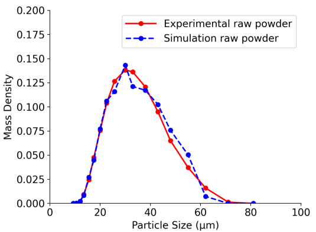
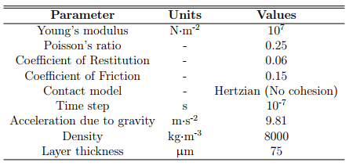

# LPBF Workbench


<!-- [Go to LPBF Workbench App](app.html){:target="_blank"} -->

<a href="app.html" class="custom-btn" target="_blank">Open LPBF Workbench App</a>

LPBF Workbench App is a web-based application designed to facilitate the simulation of Laser Powder Bed Fusion (LPBF) processes. It provides a user-friendly interface for setting up and running the Discrete Element Method (DEM) simulations of powder deposition, as well as the subsequent LPBF simulations using the `laserBeamFoam` solver in OpenFOAM.

<!-- 
## 🔹 Powder Deposition Using DEM

The powder deposition process in LPBF involves random and stochastic particle
packing. To represent the powder bed accurately, it is modelled as a
collection of discrete particles rather than a continuous medium. Particle
motion due to interactions with the recoating mechanism and neighbouring
particles is resolved using **LIGGGHTS®** [2], an open-source Discrete Element
Method solver.

In this tutorial, a rain deposition method is used to generate the powder bed.
Particles are introduced at the top of a domain with rigid boundaries and
allowed to settle under gravity onto the build plate. A monodisperse particle
size distribution is used, selected to reflect the experimentally measured
distribution for SS316L powder.

The particle size distribution is shown below [1]:



The contact model properties used in the coating simulation are provided in
the table below [1]:



---

## 🧱 Powder Bed Generation with LIGGGHTS®

The powder bed used in this tutorial has already been generated
using **LIGGGHTS®**. Therefore, **it is not necessary to regenerate it to
run the case as provided**.

However, for users interested in reproducing or modifying the powder
deposition process, the necessary input files and scripts are included in the
`DEM_small/` directory.

We provide here a brief overview to help users get started, but **this is not
a complete installation or usage guide**. For full instructions and advanced
configuration options, please refer to the official LIGGGHTS® documentation:

[LIGGGHTS® Manual and Installation Guide](https://www.cfdem.com/media/DEM/docu/Manual.html)

### 🔧 Installing LIGGGHTS® (Basic Setup)

See the instructions given in the main [`README.md`](../../../README.md) file.

---

### ▶️ Running the DEM Simulation (Optional)

The characteristics of the particles in the powder bed are defined in the file:

```bash
DEM_small/input.liggghts
```

To generate the powder bed, run the following script:

```bash
cd DEM_small
./Allrun
```

This will execute the DEM simulation using LIGGGHTS® and produce the file:

```bash
DEM_small/post/location
```

This file contains the particle positions and must be copied to the `constant/`
directory of the OpenFOAM case before running `laserBeamFoam`:

```bash
cp DEM_small/post/location LPBF_small/constant/
```

---

### ▶️ Running the LPBF Simulation

Once the `LPBF_small/constant/location` file exists, the LPBF simulation can be
 run by executing the `Allrun` script in the main `LPBF_small` directory:
The characteristics of the particles in the powder bed are defined in the file:

```bash
./Allrun
```

This `Allrun` script performs five tasks:

- Copies the `initial` directory to `0`
- Creates the mesh by running `blockMesh`
- Sets the initial metal volume fraction field using `setSolidFraction`, which
  reads the particle locations from `constant/location`
- Rotates the mesh using `transformPoints`
- Run the `laserbeamFoam` solver

---

## 📖 References

[1] G. Parivendhan, J. Paul, and A. J. King, “A numerical study of processing
parameters and their effect on the melt-track profile in Laser Powder Bed
Fusion processes,” *Additive Manufacturing*, vol. 67, p. 103482, Apr. 2023.
[https://doi.org/10.1016/j.addma.2023.103482](https://doi.org/10.1016/j.addma.2023.103482)

[2] C. Kloss, C. Goniva, A. Hager, S. Amberger, and S. Pirker, “Models,
algorithms and validation for opensource DEM and CFD–DEM,” *Progress in
Computational Fluid Dynamics*, vol. 12, no. 2/3, pp. 140–152, 2012.
 [https://doi.org/10.1504/PCFD.2012.047457](https://doi.org/10.1504/PCFD.2012.047457)


 -->
