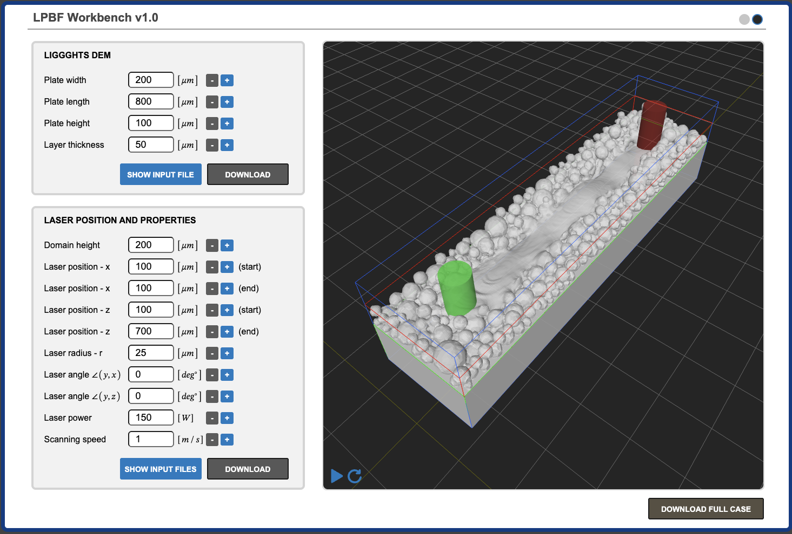

# LPBF Workbench

<!-- [Go to LPBF Workbench App](app.html){:target="_blank"} -->

<a href="app.html" class="custom-btn" target="_blank" style="display:inline-block;padding:10px 20px;background:#007bff;color:#fff;text-decoration:none;border-radius:4px;">Go to LPBF Workbench App</a>

